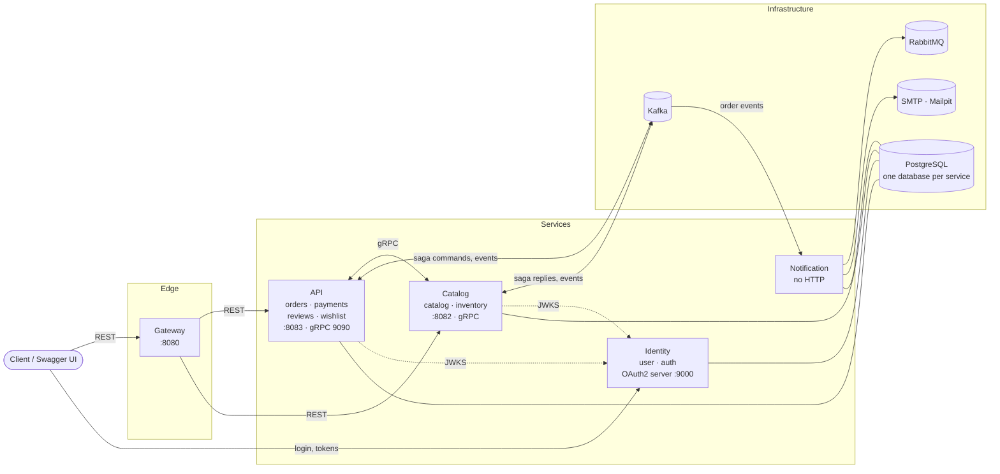
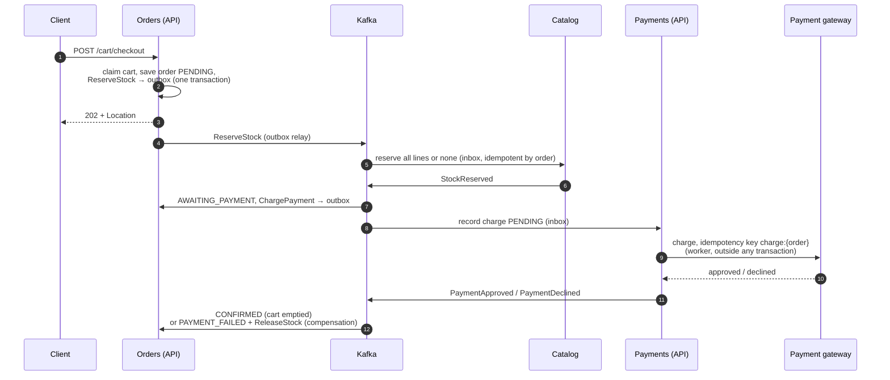
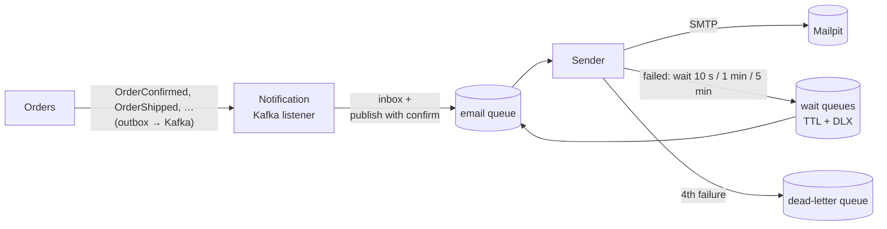

# Bookland

> An online bookstore backend, built as **five Spring Boot services** that talk over **REST, gRPC,
> Kafka and RabbitMQ** — extracted step by step from a modular monolith, with every module in
> **Clean Architecture** enforced by tests, and its failure behaviour **measured, not assumed**.


---

## Contents

- [What this project demonstrates](#what-this-project-demonstrates)
- [Architecture](#architecture)
- [Key flows](#key-flows)
- [Failure behaviour, measured](#failure-behaviour-measured)
- [Inside a service: Clean Architecture](#inside-a-service-clean-architecture)
- [Tech stack](#tech-stack)
- [Getting started](#getting-started)
- [API overview](#api-overview)
- [Security](#security)
- [Error contract](#error-contract)
- [Testing](#testing)
- [How it was built](#how-it-was-built)
- [Known limitations](#known-limitations)
- [Roadmap](#roadmap)

---

## What this project demonstrates

Bookland covers a bookstore end to end: catalog and stock, cart and checkout, payments, order
lifecycle, purchase-verified reviews, wishlist, e-mail notifications, and an OAuth2 login. The
domain is deliberately ordinary; the point is **how the system holds together when it is split
into services and things fail**.

| Topic | What is in the code |
|---|---|
| **Microservices, extracted from a monolith** | Identity, catalog and notification were carved out of a modular monolith one step at a time, each step shipped and verified before the next. The remaining monolith (orders, payments, reviews, wishlist) still runs as one deployable |
| **Orchestrated saga** | Checkout reserves stock (catalog), then charges (payments), and compensates on a decline — all over Kafka, with the order's status as the saga state |
| **Choreographed events** | Cancelling an order publishes `OrderCancelled`; catalog and payments each react on their own |
| **Transactional outbox + inbox** | Every producing module writes its messages in the same database transaction as the change; every consumer records what it has handled. At-least-once delivery, idempotent effects |
| **Money handled safely** | Payment gateway calls happen outside any transaction, with an idempotency key per operation; "no answer" is retried with backoff and never treated as a decline |
| **gRPC between services** | Batched book lookups with a deadline and a Resilience4j circuit breaker per client; contract copies checked by a test |
| **API gateway** | Spring Cloud Gateway as the single entry point, with explicit timeouts that answer the error contract (502/504) |
| **OAuth2 / OIDC** | An embedded Spring Authorization Server (authorization code + PKCE, RS256, refresh rotation); every service validates tokens as a resource server |
| **RabbitMQ as a task queue** | The notification service turns Kafka events into e-mail tasks, with delayed retries (TTL queues + dead-letter exchange), a dead-letter queue, and send-once semantics |
| **Clean Architecture, enforced** | Four layers per module; the inner three are framework-free, and ArchUnit fails the build otherwise |
| **Failure testing** | Each service and broker was taken down on purpose and the outcome measured — see [Failure behaviour, measured](#failure-behaviour-measured) |

---

## Architecture



| Service | Module(s) | Port | Owns | Talks to others via |
|---|---|---|---|---|
| **Gateway** | `bookland-gateway` | 8080 | — | Routes only: `/api/v1/books`, `/categories`, `/inventory`, `/media` → catalog (a book's reviews excepted); the rest of `/api/v1` → API |
| **API** | `bookland-app` = orders + payments + reviews + wishlist | 8083 (gRPC 9090) | carts, orders, payments, reviews, wishlists | gRPC to catalog (book data); Kafka (saga, events); serves `OrderActivity` over gRPC |
| **Catalog** | `bookland-catalog-app` = catalog + inventory | 8082 (gRPC 9091 in dev) | books, categories, stock, reservations, cover images | Serves `BookCatalog` over gRPC; Kafka (stock commands, order and rating events) |
| **Identity** | `bookland-identity-app` = user + auth | 9000 | accounts, OAuth2 authorizations | Issues the tokens; publishes its public keys at `/oauth2/jwks` |
| **Notification** | `bookland-notification-app` = notification | — | inbox, sent e-mails | Consumes order events (Kafka); its own task queue (RabbitMQ); SMTP |

**How the pieces are cut.** Each business area is a *domain module* — a library in four layers.
A *service* is an *assembly module* (main class, configuration, migrations, integration tests, no
business logic) plus the domain modules it runs. Moving a module to another service means changing
which assembly includes it; its code does not change. Each service has its own database and its own
database role, which cannot connect to another service's database.

**Who owns what on the wire.** A Kafka topic belongs to the service whose interface it is (an event
topic to its producer, a command topic to its receiver); consumers write the topic name out instead
of importing it, and keep their own copy of the payload record. Only a topic's owner creates it. A
gRPC `.proto` belongs to the server; each client keeps a copy that may differ only in its Java
package, and a test fails the build on any other difference.

---

## Key flows

### Checkout — an orchestrated saga

`POST /api/v1/cart/checkout` answers **202 Accepted** with the order `PENDING`; the client follows
the order until it settles.



- **Stock is reserved before anyone is charged.** The reservation is a conditional `UPDATE … WHERE
  stock_quantity >= :q` per line, all or nothing, recorded per order — so the last copy goes to
  exactly one customer and a duplicate command is answered from the record.
- **The order's status is the saga's state.** A reply that arrives in the wrong status is a
  duplicate or a late answer, and is ignored.
- **A second checkout while one runs** answers `409 CHECKOUT_IN_PROGRESS` (a conditional update
  claims the cart).
- **A gateway that does not answer is not a decline.** The payment stays pending and is retried with
  a doubling wait and no last attempt — giving up on a charge of unknown outcome could leave a
  customer charged for a failed order.

### Cancellation — choreography

Cancelling a `CONFIRMED` order sets it `CANCELLED` and writes `OrderCancelled` to the outbox in the
same transaction. Orders expects no answer: the catalog gives the reserved units back and payments
refunds, each idempotently, each on its own.

### Notifications — Kafka in, RabbitMQ in the middle



Kafka carries **what happened** (an event several services read); RabbitMQ carries **what to do**
(one e-mail, one worker, retried later). The e-mail is written when the event arrives — the
customer's address and name were stored on the order at checkout, so the notification service never
calls the identity service. The Kafka offset moves only after RabbitMQ confirmed the task. Each
e-mail has a key (`<order>:<kind>`) checked before sending, so a task delivered twice becomes one
e-mail.

---

## Failure behaviour, measured

Every safeguard above was checked by **breaking the real thing** — stopping a container, freezing
it, sending duplicates by hand — against the full Docker Compose stack, and timing the outcome.

| What failed | What happened | Measured |
|---|---|---|
| **Kafka down** 60 s | Checkout still answered (202) and cancellation (200); every pending step completed once Kafka returned | Checkout 0.12 s during the outage; all done **7.3 s** after Kafka came back |
| **Payment gateway down** ~70 s | Orders waited in `AWAITING_PAYMENT`; nothing declined, nothing charged twice | Confirmed **54.9 s** after the gateway returned — the price of the backoff |
| **Duplicate charge command** | One payment, one reply | Gateway charge count unchanged |
| **Identity service down** | Public reads unaffected; tokens kept validating from the cached public keys | Authenticated requests fine for ~5 min (the key cache), then 500 until it returned |
| **Catalog service stopped** | Cart still readable, items shown as "Unavailable"; add-to-cart and checkout refused fast | 503 in **~60 ms**; circuit breaker opened after 5 failures and closed by itself |
| **Catalog service frozen** | The gRPC deadline cut each call | **~2.03 s** per call; a 10-item cart **2.07 s** (one batched call, not ten); **~45 ms** with the breaker open |
| **A service behind the gateway hanging** | Found: the gateway had **no timeout** and held requests 60–90 s. Fixed: explicit timeouts, answered as `504 UPSTREAM_TIMEOUT` | **2.2 s** (stopped) / **10.2 s** (frozen) |
| **RabbitMQ down** 7 min | Checkout unaffected; e-mails waited, none lost, none duplicated | Sent as soon as RabbitMQ was healthy again |
| **SMTP server down** | Four tries (10 s, 1 min, 5 min apart), then the dead-letter queue with the reason; back mid-wait → sent on the next try, once | Intervals as configured |
| **RabbitMQ restarted** with an e-mail waiting to retry | The task survived (durable queue, persistent message) and its wait kept counting | Sent 60.2 s after its failure, with 14 s of broker downtime inside |
| **Same order event published twice by hand** | Same id stopped by the inbox; new id stopped by the sent-e-mail record | One e-mail |

Several of these experiments **found real bugs** that the test suite had not: the gateway without
timeouts, a payment outage that left no trace in the logs, a consumer creating another service's
Kafka topic with the wrong partition count, and an e-mail outage longer than five minutes silently
moving events to a dead-letter topic. Each was fixed and pinned by a test.

---

## Inside a service: Clean Architecture

Every domain module has the same four layers, and dependencies only point inward:

```
infrastructure  →  adapters  →  application  →  domain
   (Spring)        (plain Java)   (plain Java)    (plain Java)
```

| Layer | Holds |
|---|---|
| `domain/` | Entities with private constructors and `create` / `reconstitute` factories, value objects, domain services, exceptions |
| `application/` | One class per use case (`port/in`), the outbound ports it needs (`port/out`: persistence, messaging, other services, transactions) |
| `adapters/` | The internal controller (orchestrates use cases, and is the module's composition root) and presenters → view models |
| `infrastructure/` | `@RestController`s, JPA, Kafka/RabbitMQ listeners and producers, gRPC clients and servers, outbox/inbox, Spring configuration |

- **No framework in the inner layers** — no Spring, JPA or Jackson. An `ArchitectureRulesTest`
  (ArchUnit) in every module fails the build on a violation or on a dependency pointing outward.
- **Wired by hand.** Inner classes are never Spring beans; each module exposes one `@Bean` that calls
  `*Controller.create(ports)`. A use case can be unit-tested with `new`.
- **Transactions without `@Transactional`**: a `TransactionPort` implemented with
  `TransactionTemplate`, so an application service states its transaction boundary in plain Java.
- **Use cases return domain entities**; presenters shape them for HTTP.

---

## Tech stack

| Area | Technology |
|---|---|
| Language / framework | Java 21, Spring Boot 4.0.6 (Spring Framework 7) |
| Build | Maven multi-module (15 modules) |
| Persistence | Spring Data JPA, Hibernate, PostgreSQL 16 (H2 in PostgreSQL mode for dev), Flyway |
| Messaging | Apache Kafka 4.1 (KRaft) via Spring Kafka; RabbitMQ 4.1 via Spring AMQP |
| Service-to-service | gRPC (Spring gRPC, protobuf), Resilience4j circuit breaker |
| Edge | Spring Cloud Gateway (Server WebMVC) |
| Security | Spring Authorization Server (OAuth2 + OIDC, RS256), Spring Security resource servers |
| E-mail | Spring Mail (JavaMail), Mailpit in development |
| API docs | springdoc-openapi (Swagger UI) |
| Mapping / boilerplate | MapStruct, Lombok |
| Testing | JUnit 5, Mockito, AssertJ, Awaitility, ArchUnit, embedded Kafka, in-process gRPC |
| Runtime | Docker, Docker Compose (services, PostgreSQL, Kafka, Redpanda Console, RabbitMQ, Mailpit) |

---

## Getting started

### Option A — the whole stack in Docker (production profile)

**Requires:** Docker with Compose.

```bash
cp .env.example .env      # fill in the secrets — the file explains each one, including how to
                          # generate the RSA key pair that signs the tokens
docker compose up --build
```

| What | Where |
|---|---|
| API, through the gateway | http://localhost:8080 |
| Swagger UI — API / catalog / identity | http://127.0.0.1:8083/swagger-ui.html · http://127.0.0.1:8082/swagger-ui.html · http://127.0.0.1:9000/swagger-ui.html |
| Kafka UI (Redpanda Console) | http://localhost:8081 |
| RabbitMQ management | http://localhost:15672 (`bookland` / `bookland` unless set in `.env`) |
| Mailpit (every e-mail sent) | http://localhost:8025 |

The production profile seeds only the admin account from `.env` (`ADMIN_EMAIL` / `ADMIN_PASSWORD`);
books are created through the API.

### Option B — run the services from source (dev profile, seeded data)

**Requires:** Java 21 and Docker (for the brokers).

```bash
docker compose up -d kafka redpanda-console rabbitmq mailpit
./mvnw clean install -DskipTests

./mvnw spring-boot:run -pl bookland-identity-app      # :9000
./mvnw spring-boot:run -pl bookland-catalog-app       # :8082
./mvnw spring-boot:run -pl bookland-app               # :8083
./mvnw spring-boot:run -pl bookland-gateway           # :8080
./mvnw spring-boot:run -pl bookland-notification-app
```

Each service uses its own in-memory H2 database, migrated by Flyway, with sample books and two users:

| Role | E-mail | Password |
|---|---|---|
| Admin | admin@bookland.com | admin1234 |
| Customer | joao@bookland.com | joao1234 |

**Calling the API from Swagger.** Open a Swagger UI at `127.0.0.1` (not `localhost` — the
Authorization Server only accepts loopback IPs as redirect URIs, per RFC 8252), click **Authorize**,
enter the client `bookland-web` / `bookland-web-secret` (dev), and log in on the identity service's
page.

---

## API overview

Full, interactive documentation is in each service's Swagger UI. Every date on the wire is a UTC
instant (`2026-08-05T18:17:49.755Z`).

| Area | Endpoints | Access |
|---|---|---|
| **Accounts** (identity) | `POST /api/v1/auth/register` · `GET/PUT/DELETE /api/v1/users/{id}` (own account; delete deactivates) | Public / owner |
| **Login** (identity) | `/oauth2/authorize`, `/oauth2/token`, `/oauth2/jwks`, `/userinfo`, `/connect/logout`, `/.well-known/openid-configuration` | Protocol endpoints |
| **Catalog** | `GET /api/v1/books` (search, filter, sort, page) · `GET /books/{id}` · `GET /categories` · `GET /categories/{id}/books` | Public |
| | `POST /books` · `PATCH /books/{id}` · `POST /books/{id}/cover` · `DELETE /books/{id}` (soft delete) | Admin |
| **Inventory** | `PATCH /api/v1/books/{id}/inventory` · `GET /books/{id}/inventory/history` · `GET /inventory/low-stock` | Admin |
| **Cart** | `GET /api/v1/cart` · `POST /cart/items` · `PATCH/DELETE /cart/items/{bookId}` · `POST /cart/checkout` → **202** | Customer |
| **Orders** | `GET /api/v1/orders` · `GET /orders/{id}` · `DELETE /orders/{id}` (cancel) | Owner |
| | `GET /api/v1/admin/orders` · `GET /admin/orders/{id}` · `GET /admin/orders/customer/{id}` · `PATCH /admin/orders/{id}/status` | Admin |
| **Payments** | `GET /api/v1/payments/order/{orderId}` | Owner |
| **Reviews** | `GET /api/v1/books/{id}/reviews` (newest first) · `POST` (requires a delivered order with the book) | Public / customer |
| | `DELETE /api/v1/books/{id}/reviews/{reviewId}` (moderation) | Admin |
| **Wishlist** | `GET /api/v1/wishlist` · `POST /wishlist/items` · `DELETE /wishlist/items/{bookId}` · `POST /wishlist/items/{bookId}/move-to-cart` | Customer |

Order lifecycle: `PENDING → AWAITING_PAYMENT → CONFIRMED → SHIPPED → DELIVERED`, or `REJECTED` (no
stock), `PAYMENT_FAILED` (declined, with the reason), `CANCELLED` (only from `CONFIRMED`). The
simulated payment gateway declines amounts above 1000.00, so the compensation path can be triggered
on purpose.

---

## Security

- **Login is OAuth2 authorization code + PKCE** against the identity service; it issues a 15-minute
  RS256 access token (`aud = bookland-api`), an `id_token` and a single-use refresh token. A refresh
  re-reads the account, so a deactivated account or a changed role takes effect at the next refresh.
- **Every service is a resource server**, validating tokens against the identity service's public
  keys; only the identity service holds the private key.
- **`sub` is the user id, never the e-mail.** Identity travels in the token (`sub`, `email`, `name`,
  `role`); no service asks the identity service who the caller is.
- **Each module declares its own access rules**, next to its controllers; `/api/v1/admin/**` is
  admin-only by default. An `AccessMatrixIntegrationTest` in each service with an API (API, catalog,
  identity) pins who may call every route and fails the build on a route nobody classified.
- **401 and 403 never mix**: a missing, expired or invalid token is 401 with a code that says which;
  a valid token without the role is 403 `INSUFFICIENT_ROLE`.

---

## Error contract

Every error is `application/problem+json` (RFC 7807) with a machine-readable `code`, in English:

```json
{
  "status": 409,
  "title": "Conflict",
  "detail": "A checkout is already in progress for customer 6f1c…",
  "instance": "/api/v1/cart/checkout",
  "code": "CHECKOUT_IN_PROGRESS"
}
```

Validation errors add an `errors` map (field → messages); a 5xx never echoes the exception's text.
The full list of codes, and how a client should react to each, is in
**[docs/error-contract.md](docs/error-contract.md)**. The contract is also published in each
service's OpenAPI document, and contract tests lock it against the running application.

---

## Testing

```bash
./mvnw test                                   # everything (no Docker needed)
./mvnw test -pl bookland-orders               # one module
./mvnw test -pl bookland-app -Dtest=CheckoutSagaIntegrationTest
```

**450+ tests**, of four kinds:

- **Unit tests** of domain and application services against mocked ports — plain JUnit, no Spring.
- **Architecture tests** (ArchUnit) in every module, plus rules across each service: no framework in
  the inner layers, no catalog types outside the catalog, no identity types outside identity, no
  `LocalDateTime` on the wire.
- **Integration tests** per service, with the real Spring context and database, an embedded Kafka
  broker and in-process gRPC: the whole checkout saga, cancellation, payment safety (outages,
  duplicates, dead letters), stock races (twenty concurrent draws on five copies; two customers
  racing for the last one), the error
  contract, the access matrix, the published OpenAPI document. Other services are replaced by fakes
  at the gRPC/Kafka boundary; RabbitMQ and SMTP by doubles at their ports.
- **End-to-end runs and failure experiments** against the Docker Compose stack (see above).

A habit throughout: a guard is not considered tested until the test has been seen to **fail with the
guard removed**. That habit caught, among others, a retry test that passed for the wrong reason
(Spring's `ExponentialBackOff` limits the sum of its waits, not wall-clock time).

---

## How it was built

The project started as a modular monolith and was migrated in six planned steps, each one shipped,
tested and measured before the next:

1. **Preparation** — token validation moved to a shared platform module; access rules split per module.
2. **Kafka + transactional outbox** — first with a deliberate experiment showing an event lost without it.
3. **Identity service** extracted, with its own database.
4. **Checkout saga and choreographed cancellation**, plus payment idempotency and dead-letter topics.
5. **gRPC and the catalog service**, then the API gateway.
6. **Notification service** with RabbitMQ — retries, dead-letter queue, send-once.

Commits follow [Conventional Commits](https://www.conventionalcommits.org/). The architecture rules
and conventions the code follows are written down in [`CLAUDE.md`](CLAUDE.md).

---

## Known limitations

Deliberate simplifications and known gaps, stated plainly:

- **One instance per background worker.** Outbox relays and the payment worker assume a single
  instance; running replicas would need row claiming (`FOR UPDATE SKIP LOCKED`) or leader election.
- **Stock reservations do not expire.** A checkout that never finishes keeps its units reserved.
- **One PostgreSQL server** hosts every service's database (separate databases and roles) — an
  infrastructure shortcut, not a shared schema.
- **No authentication between services** on gRPC and Kafka; they rely on the internal network.
- **Logout does not revoke an access token**; it stays valid until it expires (15 minutes).
  Refresh-token reuse is refused but not treated as theft (no revocation of the token family), and
  old authorizations are not purged.
- **Dead-letter topics and queues are not reprocessed automatically** — a person inspects them.
- **Inventory history lists manual stock adjustments**; sales and cancellations appear as stock
  reservations, not as history entries.
- **Not built:** category management, password or e-mail change, an admin back-office for accounts
  and payments.
- **Lab infrastructure:** Kafka and RabbitMQ run without persistent volumes in Compose; there is no
  CI pipeline, no tracing or metrics, and no deployment beyond Docker Compose.

---

## Roadmap

- CI with GitHub Actions (build, tests, images)
- Observability: OpenTelemetry traces across HTTP, gRPC and Kafka; metrics and dashboards
- Testcontainers for PostgreSQL and RabbitMQ in the test suite
- Reservation expiry, and worker claiming for horizontal scaling
- A BFF holding tokens server-side, and GraphQL at the edge

---

<div align="center">
  Built by <a href="https://github.com/conradrenno">conradrenno</a>
</div>
